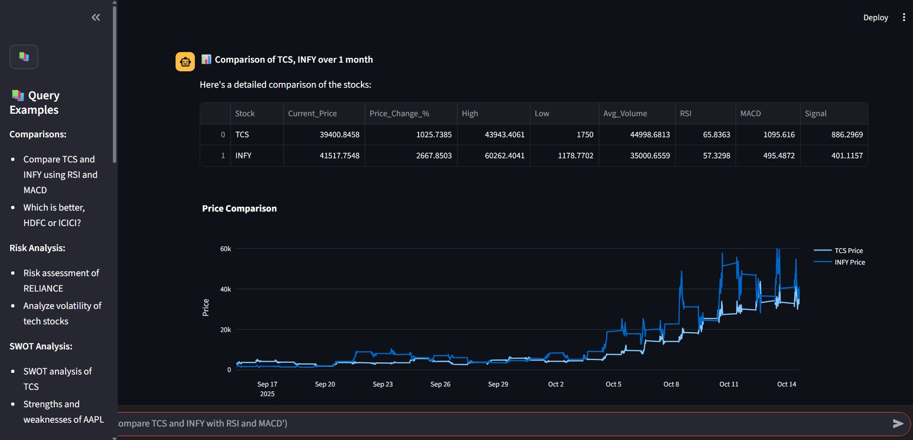
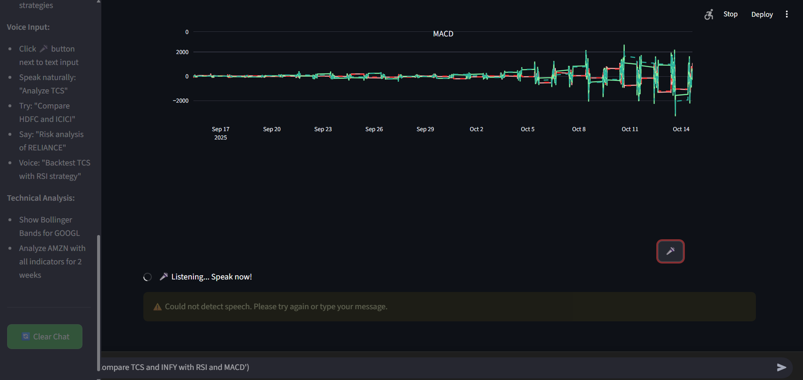

# Stock Analysis Agent






A Streamlit-based single-file agent for basic stock analysis and visualization. This repository contains a Streamlit app (`app.py`) that loads stock data, performs analysis, and displays interactive charts in the browser.

## Features

- Interactive charts and tables for stock price analysis
- Simple UI to choose tickers and date ranges
- Export/Download results
- Live market data fetch (optional; requires API key)
- Built-in technical indicators: MACD, RSI, SMA, EMA, Bollinger Bands, ATR
- Voice-enabled trade input (experimental): submit trade ideas or voice questions to the agent
- Exportable reports and downloadable CSV/Excel of analyzed data

## Agent capabilities

This project is organized as a simple financial "agent" powered by a Streamlit UI. The agent provides the following capabilities:

- Live data retrieval: fetches live or near-real-time stock prices using a configurable market-data provider (Alpha Vantage, Yahoo Finance, IEX Cloud, or other). Configure API keys in `.streamlit/secrets.toml` or environment variables.
- Technical indicators: calculates commonly used indicators so you can view momentum, trend, and volatility signals. Implemented indicators include:
  - MACD (Moving Average Convergence Divergence)
  - RSI (Relative Strength Index)
  - SMA/EMA (Simple and Exponential Moving Averages)
  - Bollinger Bands (20-period by default)
  - ATR (Average True Range)
- Strategy helpers: simple buy/sell signals based on indicator crossovers and thresholds (illustrative only, not financial advice).
- Voice-enabled input (experimental): accepts voice commands to query tickers, set date ranges, or submit trade ideas. This uses the browser microphone and optional speech-to-text backends; see the Troubleshooting / Notes below for setup.

### Inputs and outputs

- Inputs: ticker symbol(s), date range, data frequency (daily/1m/5m where available), indicator parameters, API credentials, and (optionally) voice commands.
- Outputs: interactive charts with overlays/indicators, signal tables (buy/sell/hold), downloadable CSV/Excel, and short textual summaries generated by the agent.

### Edge cases & limitations

- Data provider limits: live data depends on your chosen provider and API quota. If you exceed quotas, the agent will fall back to cached or historical data.
- Latency and intraday data: real-time intraday feeds require specific providers; free APIs often provide delayed data only.
- Indicators assume continuous historical price data; missing data or splits/dividends may affect calculations.
- Voice recognition reliability varies with microphone quality and language accent; always verify trade actions manually.

### Disclaimer

This project is an educational tool and not financial advice. Do not use it as the sole basis for trading decisions. Always verify critical information with authoritative sources before placing trades.

# Stock Analysis Agent

A Streamlit-based single-file agent for basic stock analysis and visualization. This repository contains a Streamlit app (`app.py`) that loads stock data, performs analysis, and displays interactive charts in the browser.

## Features

- Interactive charts and tables for stock price analysis
- Simple UI to choose tickers and date ranges
- Export/Download results

## Screenshots


## Quickstart

These instructions assume Windows PowerShell and a Python 3.10+ installation.

1. Clone the repository:

```powershell
git clone <your-repo-url>
cd stock-analysis-agent
```

2. Create and activate a virtual environment (recommended):

```powershell
python -m venv venv
.\venv\Scripts\Activate.ps1
```

3. Install dependencies:

```powershell
pip install -r requirements.txt
```

4. Run the Streamlit app:

```powershell
streamlit run app.py
# or if there are launcher issues
python -m streamlit run app.py
```

The app will open in your default browser at http://localhost:8501 by default.

## Project structure

- `app.py` - Main Streamlit application file
- `requirements.txt` - Python dependencies
- `.streamlit/secrets.toml` - (optional) secrets for the app
- `images/` - Folder containing UI screenshots (`img1.png`, `img2.png`)

## Troubleshooting

- If `streamlit` command fails with a launcher error, make sure you activated the correct virtualenv. Run `python -m streamlit run app.py` to bypass launcher wrappers.
- If `requirements.txt` is missing, recreate it with `pip freeze > requirements.txt` from the environment where the app works.

## Configure GROQ API

This project includes a `.env.example` with a placeholder for `GROQ_API_KEY`. You can configure the GROQ API key either via an environment file or Streamlit secrets.

1. Using a `.env` file (local development)

Create a file named `.env` in the project root (DO NOT commit real keys to GitHub). Example content:

```bash
GROQ_API_KEY=sk_live_your_real_key_here
```

Load this key in Python (recommended packages: `python-dotenv`):

```python
from dotenv import load_dotenv
import os

load_dotenv()  # reads .env
groq_key = os.getenv('GROQ_API_KEY')
```

2. Using Streamlit secrets (recommended for deployed apps)

Create or edit `.streamlit/secrets.toml` and add:

```toml
[api]
groq_key = "sk_live_your_real_key_here"
```

Access it in the app:

```python
import streamlit as st

groq_key = st.secrets.get('api', {}).get('groq_key')
```

3. PowerShell quick set (temporary in the current session)

```powershell
#$env:GROQ_API_KEY = 'sk_live_your_real_key_here'
python -c "import os; print(os.getenv('GROQ_API_KEY'))"
```

Notes

- Never commit secret keys to public repositories. Use `.gitignore` to ignore `.env` and `.streamlit/secrets.toml` if they contain credentials.
- The code that fetches live data should read the configured key and gracefully handle missing/invalid keys (fall back to cached/historical data or show an informative error in the UI).

## Development notes

- Keep the virtual environment inside the project (`venv`) or use a named environment. Always activate before running the app.
- To update dependencies:

```powershell
pip install <package>
pip freeze > requirements.txt
```

## Contribution

If you'd like to contribute, open an issue or submit a PR. Please include reproducible steps and any data samples needed to test.
